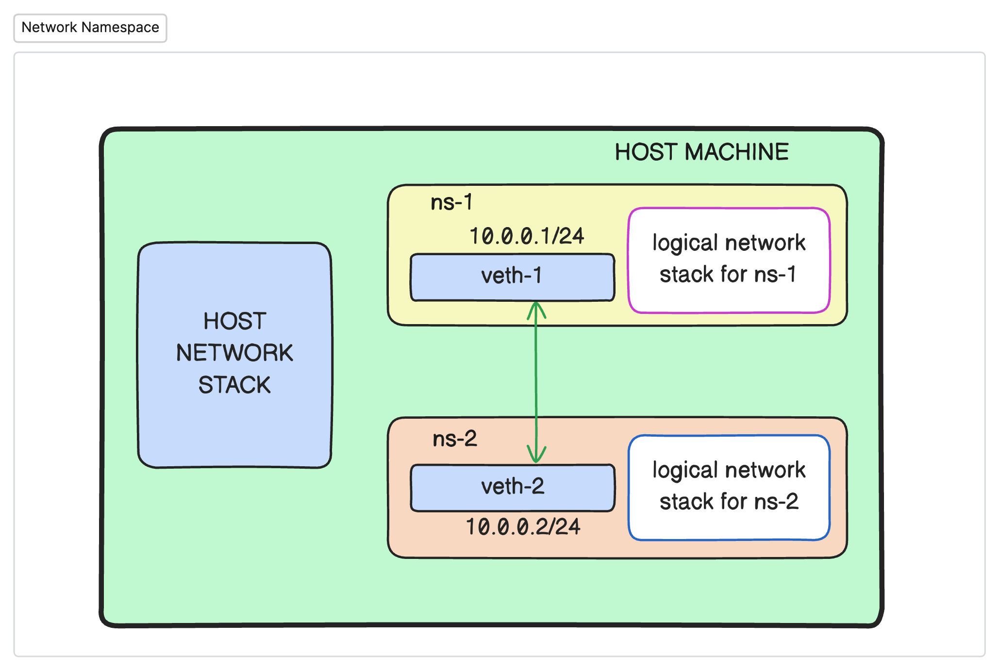

# Assignment-1 Network Namespace

This project demonstrates network namespace communication and packet capture in Linux using a Makefile for automation. It creates two network namespaces that can communicate with each other while allowing packet capture for network analysis.

## Prerequisites

- Linux operating system
- Root/sudo privileges
- Required packages:
  - `iproute2` (for network namespace management)
  - `tcpdump` (for packet capture)
  - `make` (for running the Makefile)
## Overview of the environment



## Installation

```bash
# Install required packages
sudo apt-get update
sudo apt-get install iproute2 tcpdump make
```

## Project Structure

```
.
├── Makefile              # Main automation file
├── logs/                 # Directory for packet captures
│   └── capture.pcap      # Packet capture file
└── README.md            # This documentation
```

## Network Configuration

- Network Namespace 1 (ns1):
  - Interface: veth1
  - IP Address: 10.0.0.1/24

- Network Namespace 2 (ns2):
  - Interface: veth2
  - IP Address: 10.0.0.2/24

## Usage

1. Setup the environment:
```bash
make setup
```

2. Capture packets from ns1 or ns2:
But directly these commands will not work. You have to manually `exec` into the network namespaces and manually run the command given in the make file for `capture-ns1` and `capture-ns2`.
```bash
make capture-ns1
# or
make capture-ns2
```

3. Test connectivity:
```bash
make test-ns1
# or
make test-ns2
```

4. Check status:
```bash
make status
```

5. Clean up:
```bash
make clean
```

## Makefile Targets

- `create_logs`: Creates the logs directory
- `create_namespaces`: Creates two network namespaces
- `create_interfaces`: Creates virtual ethernet interfaces
- `assigning_interfaces`: Assigns interfaces to namespaces
- `configure_interfaces`: Configures IP addresses and brings up interfaces
- `capture-ns1/ns2`: Starts packet capture in respective namespace
- `test-ns1/ns2`: Tests connectivity between namespaces
- `status`: Shows current network configuration
- `clean`: Removes all created resources

## Troubleshooting

1. If you see permission errors:
   - Make sure you're running with sudo privileges
   - Check if all required packages are installed

2. If network namespaces aren't created:
   - Verify that your kernel supports network namespaces
   - Check if any existing namespaces need to be cleaned up

3. If packet capture isn't working:
   - Ensure tcpdump is installed
   - Check if the logs directory exists and is writable

## Notes

- The packet capture files are stored in the `logs` directory
- Each namespace has its own network stack and interfaces
- The clean target will remove all created resources